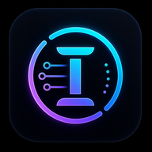

# INTERNDRA ⚡ — Private AI Operating System for Android

<p align="center">
  
</p>

<p align="center">
  <strong>A privacy-first, hybrid AI agent that runs directly on your Android device — with real terminal access, Shizuku-powered system control, and optional cloud escalation.</strong>
</p>

<p align="center">
  <a href="#-features">Features</a> •
  <a href="#-architecture">Architecture</a> •
  <a href="#-quick-start">Quick Start</a> •
  <a href="#-tech-stack">Tech Stack</a> •
  <a href="#-configuration">Configuration</a> •
  <a href="#-project-structure">Structure</a> •
  <a href="#-testing">Testing</a> •
  <a href="#-faq">FAQ</a>
</p>

<p align="center">
  
  
  
  
</p>

---

## ✨ Features

### 🤖 Hybrid AI Engine
- **Local AI** — Runs Qwen2.5-3B-Instruct via llama.cpp JNI (fully offline, no internet required)
- **Cloud AI** — Optional OpenRouter integration for GPT-4, Claude, Gemini, and 200+ models
- **Hybrid Mode** — AI dynamically chooses local vs. cloud based on task complexity
- **Gemini AI Engine** — Direct Google Gemini API integration as an alternative cloud provider
- **Prompt Optimization** — Intelligent prompt construction with context window management

### 💻 Real Terminal (Termux Integration)
- **Full PTY Terminal** — Real Unix process execution via embedded `forkpty()` JNI
- **ANSI/VT100 Emulator** — Complete escape code support (colors, cursor movement, SGR attributes)
- **Termux Bootstrap** — Embedded Linux environment with bash, apt, python, git, etc.
- **Package Management** — Install CLI tools directly (`pkg`, `apt`, `pip`)
- **Command History & Scrollback** — Full terminal history with scrollback buffer

### 🛡️ Shizuku-Powered System Access
- **Elevated Shell** — Execute commands with ADB/root-level privileges via Shizuku
- **Smart Fallback** — Automatic fallback chain: Shizuku → SmartShell (sandboxed)
- **System Operations** — Package management (`pm install/uninstall`), settings modification, file operations
- **Runtime Detection** — AI-aware capability detection for context-appropriate commands

### 🔒 Privacy & Safety
- **Safety Engine** — AI-powered command validation with 40+ regex patterns
- **Three Privacy Modes** — Local-only, Cloud-only, or Hybrid
- **Emergency Privacy Lock** — Instant kill-switch for all cloud/external connections
- **Command Normalization** — Anti-bypass protection (base64 decode, IFS substitution stripping)
- **On-Device Processing** — All sensitive AI processing stays on your device

### 🧠 Advanced AI Capabilities
- **Workflow Engine** — Multi-step task planning and execution
- **RAG (Retrieval-Augmented Generation)** — Query local knowledge base
- **Knowledge Graph** — Entity extraction and relationship mapping
- **Timeline Intelligence** — Temporal reasoning and event tracking
- **Web Search** — Integrated search pipeline with result summarization
- **OCR Engine** — On-device text recognition via ML Kit

### 🎨 Modern UI
- **Jetpack Compose** — Material 3 design with dynamic theming
- **Chat Interface** — Markdown-rendered conversations with code highlighting
- **Workspace Management** — Multiple workspaces with persistent memory
- **Terminal Screen** — Native terminal emulator with real-time output
- **Security Dashboard** — Visual privacy status monitoring
- **Notification Listener** — AI-triggered automation based on notifications

---

## 🏗️ Architecture

```
┌─────────────────────────────────────────────────────┐
│                   UI Layer (Compose)                 │
│  ┌──────────┐ ┌──────────┐ ┌──────────┐ ┌────────┐ │
│  │   Chat   │ │ Terminal │ │Workspace │ │Security│ │
│  │  Screen  │ │  Screen  │ │  Screen  │ │Dashboard│ │
│  └────┬─────┘ └────┬─────┘ └────┬─────┘ └────┬───┘ │
│       │            │            │            │      │
│  ┌────┴────────────┴────────────┴────────────┴───┐ │
│  │            ViewModels + StateFlow              │ │
│  └────────────────────┬──────────────────────────┘ │
├───────────────────────┼────────────────────────────┤
│              AI Orchestration Layer                │
│  ┌──────────┐ ┌──────────┐ ┌──────────┐ ┌──────┐  │
│  │  Safety  │ │   AI     │ │ Workflow │ │  RAG  │  │
│  │  Engine  │ │Orchestr. │ │  Engine  │ │Engine │  │
│  └────┬─────┘ └────┬─────┘ └────┬─────┘ └──┬───┘  │
│       │            │            │            │      │
│  ┌────┴────────────┴────────────┴────────────┴───┐ │
│  │        Execution Backend (TermuxEnvironment)   │ │
│  └────┬─────────────────────┬───────────────────┘ │
├───────┼─────────────────────┼─────────────────────┤
│  ┌────┴──────┐       ┌──────┴──────┐              │
│  │Termux PTY │       │Shizuku Shell│              │
│  │ (forkpty) │       │  (Elevated) │              │
│  └────┬──────┘       └──────┬──────┘              │
│       │                    │                       │
│  ┌────┴────────────────────┴───────────────────┐  │
│  │         TerminalEmulator (ANSI/VT100)        │  │
│  └──────────────────────────────────────────────┘  │
├────────────────────────────────────────────────────┤
│              Data Layer (Room + DataStore)          │
│  ┌──────────┐ ┌──────────┐ ┌──────────┐ ┌──────┐  │
│  │Messages  │ │Workspaces│ │Knowledge │ │Config│  │
│  │   DB     │ │   DB     │ │  Graph   │ │Store │  │
│  └──────────┘ └──────────┘ └──────────┘ └──────┘  │
└────────────────────────────────────────────────────┘
```

### Execution Modes

| Mode | Backend | Capabilities | Use Case |
|------|---------|-------------|----------|
| **Termux** | Embedded PTY (forkpty) | Full Linux env: bash, python, git, apt | CLI tools, scripting, development |
| **Shizuku** | ADB Shell (UID 2000/0) | System commands: pm, settings, dumpsys | Admin tasks, app management |
| **Hybrid** | Auto-detect | Best of both worlds | AI-routed command execution |
| **Fallback** | SmartShell | Sandboxed process | Basic commands, safe mode |

---

## 🚀 Quick Start

### Prerequisites
- Android 8.0+ (API 26)
- 4GB+ RAM recommended for local AI
- ~2GB free storage for local model
- [Shizuku](https://shizuku.rikka.app/) (optional, for elevated commands)
- [Termux](https://termux.com/) (optional, standalone Termux integration)

### Clone & Build

```bash
git clone https://github.com/MythroniX24/INTENDRA.git
cd INTENDRA

# Build debug APK
./gradlew assembleDebug

# Build with tests
./gradlew testDebugUnitTest
```

The APK will be at `app/build/outputs/apk/debug/app-debug.apk`.

### OpenRouter API Key (For Cloud AI)
1. Sign up at [OpenRouter](https://openrouter.ai/)
2. Create an API key
3. Enter it in the app Settings → Cloud AI → API Key

### Local Model Setup
1. Open app → Settings → Model Download
2. Tap "Download Qwen2.5-3B" (or download manually from HuggingFace)
3. Wait for download to complete (~2GB)
4. The app auto-detects the model at `internal storage/INTERNDRA/models/`

---

## 🛠 Tech Stack

| Category | Technology |
|----------|-----------|
| **Language** | Kotlin 1.9.22 |
| **UI** | Jetpack Compose (BOM 2024.12.01), Material 3 |
| **Architecture** | MVVM + Repository Pattern, StateFlow |
| **Local AI** | llama.cpp JNI (Qwen2.5-3B-Instruct Q4_K_M) |
| **Cloud AI** | OpenRouter API, Google Gemini API |
| **Database** | Room (with KSP), DataStore Preferences |
| **Terminal** | Custom PTY via forkpty() JNI, ANSI/VT100 Emulator |
| **Shell Access** | Shizuku API (elevated), SmartShell (sandboxed) |
| **Networking** | OkHttp 4.12.0, Gson 2.11.0 |
| **Image Loading** | Coil (Compose) |
| **Markdown** | Markwon |
| **Web Scraping** | Jsoup 1.18.1 |
| **OCR** | ML Kit (on-device) |
| **Build** | Gradle 8.9, Android Gradle Plugin 8.7.3 |
| **CI** | GitHub Actions (NDK + Kotlin Compilation + Unit Tests) |
| **Testing** | JUnit 4, Mockk, Truth, Turbine, Espresso, Jacoco |

---

## ⚙️ Configuration

### Gradle Properties (`gradle.properties`)
```properties
org.gradle.jvmargs=-Xmx3072m -Dfile.encoding=UTF-8
org.gradle.parallel=true
org.gradle.caching=true
android.useAndroidX=true
```

### BuildConfig Fields
The app exposes these build-config constants:
- `LOCAL_MODEL_FILENAME` — Qwen2.5-3B-Instruct-Q4_K_M.gguf
- `LOCAL_MODEL_URL` — HuggingFace download URL
- `OPENROUTER_DOMAIN` — Default: openrouter.ai
- `OPENROUTER_API_KEY` — Set via environment variable (empty in release builds)

### NDK/CMake
The native PTY terminal requires NDK 27+. The CMake config is at:
```
app/src/main/jni/CMakeLists.txt
```

---

## 📁 Project Structure

```
app/src/main/java/com/interndra/
├── InterndraApplication.kt          # Application class
├── MainActivity.kt                   # Entry point
├── agent/
│   └── TerminalAgent.kt              # Terminal AI agent
├── ai/
│   ├── agents/                       # AI agent implementations
│   ├── graph/                        # Knowledge graph
│   ├── intelligence/                 # Timeline & reasoning
│   ├── ocr/                          # On-device OCR
│   ├── rag/                          # Retrieval-Augmented Generation
│   ├── system/                       # System health monitor
│   ├── tasks/                        # Task management
│   ├── tools/                        # AI tool definitions
│   ├── workflow/                     # Workflow engine
│   ├── AiOrchestrator.kt            # Central AI coordinator
│   ├── ChatTitleGenerator.kt        # Auto-chat title generation
│   ├── CloudAiEngine.kt             # OpenRouter cloud AI
│   ├── GeminiAiEngine.kt            # Google Gemini integration
│   ├── JailbreakEngine.kt           # Prompt injection detection
│   ├── LocalAiEngine.kt             # Local llama.cpp AI
│   ├── SafetyEngine.kt              # Command validation
│   └── AICommandRegistry.kt         # AI command routing
├── data/
│   ├── knowledge/                    # Knowledge base storage
│   ├── local/                        # Local data sources
│   └── model/                        # Data models/DAOs
├── jni/
│   └── JniTermux.kt                  # JNI wrapper for native code
├── plugin/
│   ├── GitPlugin.kt                  # Git integration
│   ├── PackageManagerPlugin.kt       # Package management
│   └── TermuxPlugin.kt               # Termux integration
├── search/
│   └── WebSearchEngine.kt            # Web search pipeline
├── service/
│   ├── ShizukuShell.kt               # Shizuku elevated shell
│   ├── ShizukuManager.kt             # Shizuku lifecycle manager
│   ├── PersistentShell.kt            # Persistent shell session
│   ├── TermuxEnvironment.kt          # Execution environment manager
│   └── TerminalConfig.kt             # Terminal configuration
├── services/
│   ├── AgentAccessibilityService.kt  # UI automation service
│   └── InterndraNotificationListener.kt # Notification trigger
├── terminal/
│   ├── TerminalEmulator.kt           # ANSI/VT100 emulator
│   ├── TerminalSession.kt            # PTY session manager
│   └── ByteQueue.kt                  # Thread-safe byte buffer
├── ui/
│   ├── components/                   # Reusable composables
│   ├── screens/                      # App screens
│   ├── theme/                        # Material 3 theming
│   └── viewmodel/                    # ViewModels
└── util/
    └── ImageCacheUtil.kt             # Image caching utility
```

---

## 🧪 Testing

The project includes **672+ unit tests** covering all major components.

### Running Tests
```bash
# All unit tests
./gradlew testDebugUnitTest

# Single test class
./gradlew testDebugUnitTest --tests "com.interndra.ai.SafetyEngineTest"

# With coverage
./gradlew testDebugUnitTest jacocoTestReport
```

### Test Categories
| Package | Tests | Coverage |
|---------|-------|----------|
| AI Engine | AICommandRegistry, AiOrchestrator, CloudAiEngine, GeminiAiEngine, LocalAiEngine, SafetyEngine | Core AI logic |
| Terminal | TerminalEmulator, TerminalSession, ByteQueue | PTY & ANSI parsing |
| Services | TermuxEnvironment, PersistentShell, TerminalBuffer, TerminalConfig | Execution backends |
| Agents | TerminalAgent | Agent behavior |
| UI | ChatTitleGenerator | Title generation |

---

## 🔐 Privacy

INTERNDRA is designed with privacy as a core principle:

- **All AI processing is on-device by default** — no data leaves your phone
- **Cloud mode requires explicit opt-in** — per-session consent for cloud AI
- **Emergency Privacy Lock** — one-tap disconnect from all cloud/external services
- **No telemetry** — the app does not collect usage data
- **Open source** — fully auditable codebase

---

## 📋 FAQ

**Q: Why is there a "Termux" and "Shizuku" mode?**
A: Termux provides a full Linux terminal environment (bash, Python, git). Shizuku provides elevated (ADB/root) privileges for system commands. They serve different purposes and can be used together in Hybrid mode.

**Q: Can I install Python/node/CLI tools?**
A: Yes! In Termux mode, use `pkg install python`, `pkg install nodejs`, etc. The embedded bootstrap supports apt/pkg package management.

**Q: How do I get Shizuku working?**
A: Install Shizuku from [GitHub](https://github.com/RikkaApps/Shizuku), enable it via ADB (`adb shell sh /sdcard/Android/data/moe.shizuku.privileged.api/files/start.sh`) or root, then authorize INTERNDRA in Shizuku app.

**Q: Will the local model work on my device?**
A: Qwen2.5-3B requires ~2GB storage and 4GB RAM. Devices with 6GB+ RAM are recommended. The app gracefully falls back to cloud AI if the local model fails to load.

**Q: How do I get the latest features?**
A: Build from source (`main` branch) or check the [Releases](https://github.com/MythroniX24/INTENDRA/releases) page for pre-built APKs.

---

## 🤝 Contributing

Contributions are welcome! Please read our [Contributing Guidelines](CONTRIBUTING.md) and [Code of Conduct](CODE_OF_CONDUCT.md) before submitting PRs.

### Quick Start for Contributors
1. Fork the repository
2. Create a feature branch (`git checkout -b feat/amazing-feature`)
3. Commit changes (`git commit -m 'feat: add amazing feature'`)
4. Push (`git push origin feat/amazing-feature`)
5. Open a Pull Request
6. Ensure CI passes (GitHub Actions runs tests + build automatically)

---

## 📄 License

This project is licensed under the MIT License — see the [LICENSE](LICENSE) file for details.

---

## 🙏 Acknowledgments

- [llama.cpp](https://github.com/ggerganov/llama.cpp) — Local LLM inference engine
- [Shizuku](https://github.com/RikkaApps/Shizuku) — Elevated shell access
- [Termux](https://github.com/termux/termux-app) — Terminal emulator inspiration
- [OpenRouter](https://openrouter.ai/) — Multi-model AI API
- [Jetpack Compose](https://developer.android.com/jetpack/compose) — Modern Android UI

---

<p align="center">
  Made with ❤️ by <a href="https://github.com/MythroniX24">MythroniX24</a>
  <br/>
  <sub>Version 2.1.0 — INTERNDRA: Your Private AI Operating System</sub>
</p>
